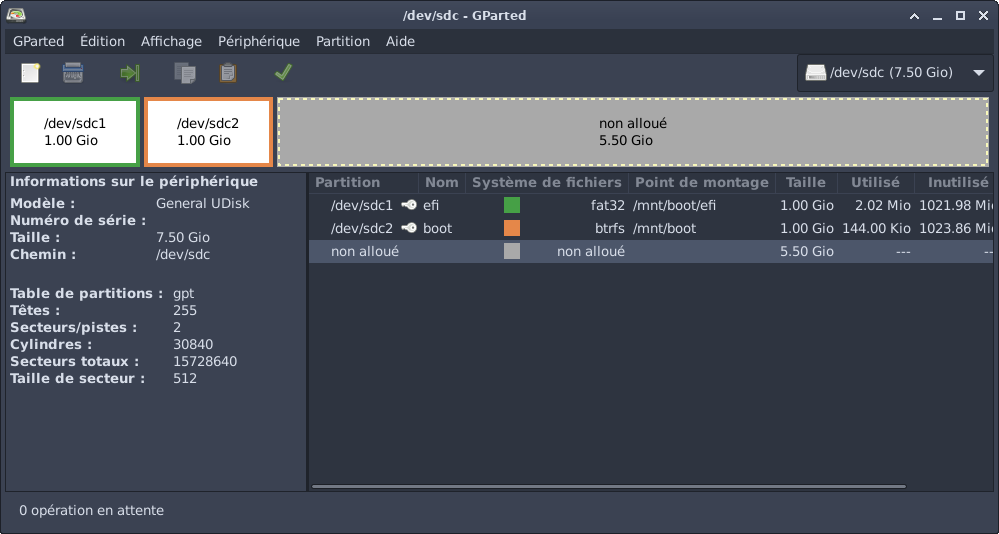

# Installation manuelle de Debian 12 (Bookworm) avec Debootstrap

## Motivations:
- pas trouvé de tutoriel simple et complet pour installer Debian manuellement
- les tutoriels existants sont soit partiels, soit trop vieux pour être suivis facilements
- la manière "correcte" d'utiliser les commandes n'est jamais expliquée correctement (initramfs, dpkg-reconfigure, task-sel,...)


## Non traité:
Pour simplifier au maximum, je n'ai traité qu'une installation simple.
En particulier, je n'ai pas traité:
- les sous-volumes btrfs
- le chiffrement de la racine avec LUKS
- les partitions logiques LVM
- le swap (facile à faire, mais je préfère utiliser un fichiers ou une partition logique LVM)

Le swap en particulier est important pour éviter que Linux ne soit obligé de fermer des applications lorsqu'il n'a plus de mémoire. On peut utiliser une partition, un fichier, ou unep partition logique LVM.

Dans mes installations personnelles, j'utilise:
- un volume chiffré qui remplit le disque entier
- des partitions logiques LVM comme swap et racine
- un système de fichier btrfs, avec des sous-volumes pour décomposer la partition en plusieurs sous-partitions, dont la racine et des stockages pour mes fichiers, mes machines virtuelles,...

Cette architecture a pour avantage de permette:
- des snapshots des dossiers
- des installations parallèles de différents systèmes d'exploitation dans des dossiers d'une même partition btrfs
- du Copy on Write (CoW) à travers tout mon système
- une compression transparente et automatique sur les sous-volumes (par exemple, j'ai un dossier archive qui compresse automatiquement tous les fichiers déplacés dedans)
- le disque entier étant chiffré, je peux garder des données confidentielles même sur un ordinateur portable
- si besoin, je peux redimensionner les partitions en live (sans éteindre mon ordinateur) grâce à btrfs et LVM
- si besoin, je peux utiliser une clé usb de déchiffrement (avec les partitions efi et /boot) pour bloquer mon ordinateur en l'absence de la clé usb

Grâce à KVM et virtiofs, je peux garder tous ces avantages dans les machines virtuelles, en utilisant un environnement créé comme décrit ici pour démarrer une machine virtuelle à partir d'un dossier.


## Préparatifs

### Debootstrap
```sh
apt install debootstrap
```
Debootstrap permet de créer un environnement Debian dans un dossier. Il peut être téléchargé manuellement, mais il est plus simple à installer directement avec apt.

### Arch install scripts
```sh
apt install arch-install-scripts
```
Ce paquet contient des outils tirés de Arch Linux, comme `genfstab` (générateur de `/etc/fstab`) ou `arch-chroot` (script basé sur `chroot` qui facilite l'entrée dans l'environnement créé par `debootstrap`).

## Partitionnement
Dans cette installation, j'utilise un boot UEFI, avec 3 partitions:
- partition d'amorce de démarrage EFI (plus tard montée sur /boot/efi)
- partition de démarrage du noyau (/boot)
- partition racine (/)

Le partitionnement peut se faire avec Gparted:


### Explications
Démarrer avec UEFI nécessite une table partition de type GPT.
La partition EFI doit être au format FAT pour être reconnue par le bios (fat32 par exemple).
Dédier une partition à /boot n'est pas nécessaire si Grub, le bootloader, peut lire la partition racine directement (ce qui est souvent le cas).
Par contre, pour pouvoir chiffer la partition racine avec la dernière version de LUKS, il est actuellement nécessaire de démarrer le noyau Linux (avec la partition boot) avant de pouvoir déchiffrer la partition racine.

De manière générale, je conseille de garder une partition /boot séparée, car c'est le noyau Linux qui se trouve sur cette partition qui va pouvoir charger les drivers nécessaires pour ouvrir la partition racine.

La partition /boot peut être de n'importe quel type tant qu'elle est lisible par Grub (ext4 par exemple), c'est pourquoi je recommande d'utiliser btrfs, un système de fichiers beaucoup plus puissant.

Dans mon cas, j'ai utilisé btrfs pour la partition /boot et la partition racine.


Ici, les partitions EFI et /boot font chacune 1Go, mais 512Mo chacune est très (très) largement suffisant. J'ai choisi de mettre 1Go dans chacune des partitions parce que cette clé USB ne sert qu'au démarrage (la racine se trouve ailleurs).


## Montage

Ici, les partitions efi, boot et root sont /dev/sdc1, /dev/sdc2, /dev/sdc3:
```sh
sudo mount /dev/sdc3 /mnt
sudo mkdir -p /mnt/boot
sudo mount /dev/sdc2 /mnt/boot
sudo mkdir -p /mnt/boot/efi
sudo mount /dev/sdc1 /mnt/boot/efi
```

Cette architecture permet de préparer dans /mnt tout le système tel qu'il sera une fois démarré, et d'utiliser des programmes comme Grub (le paquet utilisateur) pour installer les outils de démarrage du système.

`mkdir -p` permet de créer les chemins si ils n'existent pas déjà.


## Création de l'environnement
```sh
sudo debootstrap --include=ca-certificates stable /mnt
```
`--include` sert à pré-installer des paquets. Le paquet `ca-certificates` contient les certificats SSL nécessaires pour que le système puisse utiliser https, notamment avec apt.

Ce paramètre est optionnel, mais doit être installé avant de pouvoir remplacer les sources avec apt.


## Entrer dans le nouvel environment
À partir d'ici, on peut entrer dans l'environnement Debian avec:
```sh
LANG=C.UTF-8 sudo arch-chroot /mnt
# commandes à exécuter
exit
```
La variable d'environnement LANG n'est pas nécessaire, mais permet d'utiliser les caractères UTF-8 dans l'environnement.
Sans cette variable, les caractères spéciaux comme é ne sont pas utilisables, car leur encodage dépend de la langue utilisée par le système et le système Debian n'a pas encore de langues supplémentaires installées.

Pour vérifier les variables d'environnement du système, on peut utiliser la commande env:
```sh
env | grep LANG
```
La valeur C.UTF-8 correspond à la langue par défaut de l'ordinateur.


## Installation manuelle des certificats
Pour installer manuellement les certificats SSL (si ils n'ont pas été installés avec `debootstrap`), on peut faire:
```sh
sudo arch-chroot /mnt
apt update
apt install ca-certificates
exit
```

## Configuration de apt

Pour importer la configuration d'un Debian existant:
```sh
sudo cp /etc/apt/sources.list /mnt/etc/apt/sources.list
```
Puis, depuis l'environnement créé:
```
apt update
```
Cette étape nécessite d'avoir installé les certificats SSL.

### Explications

Par défaut, Debootstrap installe cette configuration dans `/etc/apt/sources.list`:
```
deb http://deb.debian.org/debian stable main
```

Lorsqu'on installe Debian avec l'installateur, on obtient plutôt une configuration comme celle ci:
```
deb http://deb.debian.org/debian/ bookworm main non-free-firmware
deb-src http://deb.debian.org/debian/ bookworm main non-free-firmware

deb http://security.debian.org/debian-security bookworm-security main non-free-firmware
deb-src http://security.debian.org/debian-security bookworm-security main non-free-firmware

# bookworm-updates, to get updates before a point release is made;
# see https://www.debian.org/doc/manuals/debian-reference/ch02.en.html#_updates_and_backports
deb http://deb.debian.org/debian/ bookworm-updates main non-free-firmware
deb-src http://deb.debian.org/debian/ bookworm-updates main non-free-firmware
```

Les différences principales sont:
- Les urls sont en `https` plutôt qu'en `http` (requiert le package `ca-certificates`)
- Les lignes avec deb-src servent à accéder aux codes sources des packages (peuvent être téléchargés avec `apt source <pkg>`)
- `bookworm` (Debian 12) est la version stable actuelle. Utiliser stable au lieu de `bookworm` permet de passer automatiquement sur la nouvelle version LTS dès que possible.
- Les lignes en -updates contiennent les mises à jours disponibles dans les versions futures compatibles avec la version actuelle.
- Les lignes en -security contiennent les mises à jour de sécurité
- `main`, `contrib` et `non-free-firmware` sont les types de paquets installables. Dans notre cas, `non-free-firmware` est nécessaire pour installer les drivers propriétaires.

Dans mon cas, j'ai utilisé cette configuration:
```
#deb http://deb.debian.org/debian stable main
deb https://deb.debian.org/debian/ stable main contrib non-free-firmware
deb-src https://deb.debian.org/debian/ stable main contrib non-free-firmware

deb https://security.debian.org/debian-security stable-security main contrib non-free-firmware
deb-src https://security.debian.org/debian-security stable-security main contrib non-free-firmware

deb https://deb.debian.org/debian stable-updates main contrib non-free-firmware
deb-src https://deb.debian.org/debian stable-updates main contrib non-free-firmware
```

## Paquets essentiels

Pour améliorer l'utilisabilité du terminal du nouvel environnement (optionnel):
```sh
apt update
apt install bash-completion command-not-found vim
# définir vim (2-vim.basic) comme éditeur de texte par défaut
update-alternatives --config editor
# charge le cache de command-not-found
apt update
```

### Explications
- `command-not-found` est le paquets qui ajoute au terminal les suggestions de paquets à installer lorsqu'une commande n'est pas trouvée.
- `bash-completion` ajoute l'auto-completion à bash
- Si vous préférez nano, vous n'avez pas besoin d'installer vim.

Ces ajouts ne sont pas forcément visibles en `arch-chroot` ni en tant que root.

```
TODO: à tester et mettre à jour
```


## Fstab

Le fichier `/etc/fstab` (filesystem table) contient la liste des partitions à monter par le système au démarrage, et les options de montage. Son format exact est assez obscur, mais assez simple à modifier à partir d'un exemple.

Grâce au montage réalisé sur `/mnt`, `genfstab` va pouvoir trouver automatiquement les partitions à décrire dans le fstab:
```sh
genfstab -U /mnt >> /mnt/etc/fstab
```

Attention, cette commande doit être exécutée en tant que root pour que `>>` puisse ajouter au fichiers `/mnt/etc/fstab` (sudo ne suffit pas).
Une alternative possible est d'utiliser la commande tee pour écrire dans le fichier:
```sh
genfstab -U /mnt | sudo tee /mnt/etc/fstab
```

Ensuite, vous pouvez vérifier que le fichier fstab contient bien les bonnes partitions, et ne contient pas les autres partitions (notamment le swap, si votre ordinateur en utilise un actuellement).

### Explications

Le paramètre `-U` indique à `genfstab` d'utiliser les UUID (identifiants universellement uniques) pour éviter de les confondre, en particulier lorsque les disques changent de nom (/dev/sda, /dev/sdb,...).

Si vous préférez nommer les partitions manuellement et donner du sens aux entrées du fstab, Une autre possibilité est d'utiliser LVM et d'utiliser des partitions logiques nommées(`/dev/laptop/root`), ou de donner des noms aux partitions dans gparted (`/dev/disk/by-partlabel/efi`). Mais en général, les UUID suffisent.


Voici un exemple de fstab généré avec `genfstab -U`:
```
# /etc/fstab: static file system information.
#
# Use 'blkid' to print the universally unique identifier for a
# device; this may be used with UUID= as a more robust way to name devices
# that works even if disks are added and removed. See fstab(5).
#
# <file system> <mount point>   <type>  <options>       <dump>  <pass>
# /dev/sdc3
UUID=f5758230-b6b0-42d8-a472-798c0289346a	/         	btrfs     	rw,relatime,ssd,space_cache=v2,subvolid=258,subvol=/@root/debian	0 0

# /dev/sdc2
UUID=bf4809fe-db40-4873-9dff-dee8b07c7ad2	/boot     	btrfs     	rw,relatime,space_cache=v2,subvolid=5,subvol=/	0 0

# /dev/sdc1
UUID=0055-148F      	/boot/efi 	vfat      	rw,relatime,fmask=0022,dmask=0022,codepage=437,iocharset=ascii,shortname=mixed,utf8,errors=remount-ro	0 2

# /dev/mapper/thinkpad-swap
UUID=cd712d3d-4fb5-4bea-bdef-92894283d7d5	none      	swap      	defaults  	0 0
```


Dans mon cas, j'ai dû retirer la partition swap (/dev/mapper/thinkpad-swap), qui est utilisée par mon ordinateur, mais pas par l'installation future.

J'ai laissé le reste tel quel. Les options de montage des partitions btrfs et vfat peuvent être remplacées par `defaults` pour simplifier (`genfstab` explicite toutes les options par défaut des partitions), à l'exception de subvol=@root/debian qui est spécifique à mon installation.


## Installation du noyau et des drivers

```sh
apt install linux-image-amd64 firmware-linux
apt install btrfs-progs lvm2 cryptsetup
```

### Explications

Le paquet `linux-image-amd64` est un méta-paquet (il sert juste à installer automatiquement la dernière version du noyau Linux). Attention à ne pas installer le paquet d'une version spécifique, comme `linux-image-6.1.0-26-amd64`.

Le paquet `firmware-linux` installe les drivers, y compris les drivers propriétaires (si apt est correctement configurée)

```
TODO: vérifier que le paquet firmware-iwlwifi est bien installé par tasksel et qu'il n'y a pas besoin de l'installer manuellement avec firmware-linux
```

Les paquets `btrfs-progs`, `lvm2` et `cryptsetup cryptsetup-initramfs` sont nécessaire pour que le système puisse démarrer avec des partitions btrfs, des partitions logiques LVM ou des volumes chiffrés LUKS.


## Grub

```sh
apt install grub-efi
# génère la configuration grub à partir du noyau dans /boot
update-grub
grub-install --no-nvram
```

### Explications (IMPORTANT)
Le paquet grub (installé avec apt) contient les programmes utilitaires (install-grub et update-grub notamment) qui servent à installer grub (le bootloader). C'est le bootloader qui va être exécuté lorsque la machine démarre.

Attention, il existe plusieurs paquets grub pour différentes architectures, et grub2 n'est pas le bon.

Si l'installation (grub-install) se déroule correctement, la plateforme sélectionnée sera x86\_64-efi (processeurs 64bit en boot uefi) et l'installation ne génèrera pas d'erreurs.

Par défaut, grub utilise /boot/efi pour installer le bootloader et /boot pour chercher le noyau linux. Il n'y a donc rien à configurer. Si besoin, on peut configurer grub-install avec:
```sh
grub-install \
    --target=x86_64-efi \
    --efi-directory /boot/efi \
    --bootloader-id=debian-test
```

Par rapport à la NVRAM:
La plupart des ordinateurs ont une mémoire dans le bios pour retenir plusieurs options de boot. Si vous lancez `grub-install` sans `--no-nvram` et que vous avez déjà un système debian installé, grub remplacera l'entrée "debian" de votre système d'exploitation par celle du nouveau système.

Cette situation peut être dangereuse car elle peut bloquer votre ordinateur avec un système inutilisable.
Un autre danger est que la commande grub-install est fréquemment lancée pendant les installations de paquets qui ajoutent des drivers ou pendant les mises à jour du noyau.

Si vous avez par erreur réécrit l'entrée NVRAM de votre debian, vous pouvez la restorer en lançant `grub-install` depuis votre système d'exploitation.
Vous pouvez aussi le faire depuis une clé usb live, en reproduisant le même montage qu'ici et en lançant `grub-install` après être entré dans votre système avec `arch-chroot`.

Vous pouvez aussi créer une autre entrée de boot avec `grub-install` sur votre ordinateur, avec le paramètre `--bootloader-id=<nom>` pour créer une autre entrée de boot.

Dans mon cas, j'ai juste écrasé les changements à la NVRAM de mon ordinateur avec `grub-install` (hors du `chroot`), car la partition efi se trouve sur une clé usb (il me suffit de démarrer sur la clé usb lorsque je veux démarrer sur le nouveau système).


# Internet

```sh
apt install network-manager
```

(Heureusement plus simple que [ça](https://wiki.archlinux.org/title/Network_configuration#Network_management))

Pour le wifi sur les ordinateurs portables, faites attention avoir une interface graphique pour pouvoir choisir le réseau wifi sans devoir passer par la console.


## Autres configurations

Ces configurations sont importantes pour avoir un système complet, mais ne sont pas nécessaires pour tester le démarrage.

Si vous souhaitez juste un système qui marche, définissez un mot de passe root (commande `passwd`) et sautez cette partie.

### Timezone

```sh
dpkg-reconfigure tzdata
```
Choisir Europe/Paris.

### Localisation

```sh
apt install locales
dpkg-reconfigure locales
```

Choisir `en_US.UTF-8` et `fr_FR.UTF-8`, puis `fr_FR.UTF-8` en langue par défaut.

### Hostname

Éditez le fichier `/etc/hostname` pour mettre le nom de la machine. Le nom est arbitraire et peut être changé plus tard.

### Hosts

Optionnel: éditez le fichier `/etc/hosts` et ajoutez une ligne:
`127.0.1.1  <hostname>`

#### Explications

L'adresse IP 127.0.1.1, tout comme 127.0.0.1 (localhost) correspond à la machine locale.
Sur Debian, cette adresse est censée être utilisée pour le hostname.

J'ai passé beaucoup de temps sans cette configuration, et je n'ai jamais vu à quoi elle pouvait servir, mais l'installateur la définit automatiquement.


[source](https://serverfault.com/questions/363095/why-does-my-hostname-appear-with-the-address-127-0-1-1-rather-than-127-0-0-1-in)

### Utilisateurs

```sh
apt install sudo
```

```sh
adduser <user>
usermod -aG sudo <user
```

Alternative (non-interactif):
```sh
# crée un utilisateur avec un dossier dans /home/
useradd <user> -m
# définit le mot de passe de <user>
passwd <user>
# modifie <user> pour l'Ajouter au Groupe sudo
usermod -aG sudo <user>
```


### Console


```sh
apt install console-setup
```
Choisir "Other", puis "French", puis Azerty, puis "Guess Optimal character set".

Pour modifier la disposition de clavier après:
```sh
dpkg-reconfigure keyboard-configuration
```


## Interface graphique

Cette étape est la dernière dans l'installation graphique. Elle peut être réalisée plus tôt, mais j'ai préféré garder le même ordre.

La manière la plus simple pour installer un environnement de bureau (DE) est d'utiliser le même outil que l'installateur graphique, `tasksel`:
```sh
# installe XFCE
tasksel install xfce-desktop
# installe les paquets utiles aux ordinateurs portables, dont notamment le wifi
tasksel install laptop
```


### Explications

L'outil tasksel correspond au menu des choix d'installations en fin d'installation graphique.

On peut simplement lancer la commande `tasksel` pour avoir un menu de sélection similaire à l'installateur graphique.

On peut aussi utiliser tasksel de manière non-interactive:
```sh
# liste les choix possibles
tasksel --list-tasks
# installe une tâche spécifique
tasksel install ssh-server
# liste les paquets installés par une tâche
tasksel --task-packages web-server
```

Cette dernière option n'est pas très utile car toutes les tâches tasksel sont associées à un méta-paquet. Par exemple, `tasksel --task-packages laptop` renvoie `task-laptop`.
En fouillant récursivement les dépendances avec `apt-cache depends task-laptop`, on peut quand même voir quels types de paquets seront installés

